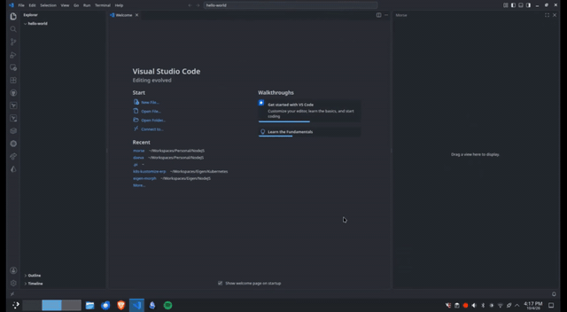
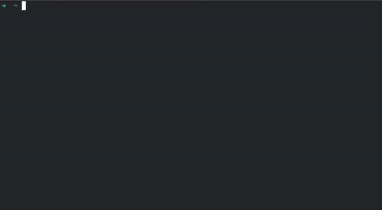

# Morse

[](LICENSE)
[](https://github.com/supanadit/morse/actions/workflows/ci.yml)
[](package.json)

**A comfortable GUI for the [Pi](https://github.com/earendil-works/pi) coding agent** — a chat panel inside
VS Code, or a browser UI served by a small NestJS host.

Pi normally lives in your terminal as a TUI. Morse gives the same agent, models, tools and sessions a real
interface without reimplementing any of it: both hosts share one core, one wire protocol and one Angular
frontend, so there are two ways to run Morse and one behaviour to maintain.

## Demo

VS Code extension:



Browser host:



Both clips run the same agent, transcript and protocol; only the host differs.

## A note on how this is built

Morse is **vibe coded**: it was written with an AI, and it exists to drive an AI. This is an agent harness,
not a product with a roadmap — it is only worth maintaining while the agent it drives is worth running. I do
not have the time to maintain it full-time, and paying someone to maintain a harness for an agent you already
pay to run makes little sense. Using AI here is not a shortcut; it is the point.

## Highlights

- **Multiple sessions across multiple projects** — one `pi` process per session, kept warm (LRU), alive while
  you switch projects or reload the page. An **In progress** section lifts the sessions working right now, and
  a refresh reattaches and replays the transcript.
- **A real transcript** — markdown with highlighted, copyable code blocks; tool calls as a compact tree by
  default (one summary line per turn, steps and their files nested under it — the always-open timeline is one
  toggle away); thinking that streams as it arrives; paged history for long sessions.
- **Steer while it works** — `steer`, follow-up and abort. A prompt sent mid-run is queued as a follow-up
  above the composer (`Queued messages`: edit, send now, remove) rather than refused, and runs when the
  current turn settles. Model and thinking-level pickers and context compaction, all without leaving the chat.
- **Edit or fork what was sent** — edit-and-resend forks before a past prompt and sends the rewrite; fork
  branches there and hands the prompt back to the composer. The old branch stays resumable.
- **Attach context the way each host can** — editor selection and live selection chips in VS Code; drag, drop
  and pasted images everywhere; browser uploads land next to the session and ride as `@mentions`.
- **`@mention` anything** — a gitignore-aware picker for files *and* directories (`@docs/` drills in), opened
  with `+` or by typing `@`, with markdown formatting in your own prompts too.
- **Native interactions in VS Code** — pi's interaction requests become QuickPick/InputBox there, and are
  rendered inline in the browser.
- **Git and files where there is no editor** — on the browser host, a git panel (commit list, branch graph,
  uncommitted changes) and an Explorer, with read-only previews, diff views, and line ranges you drag to pin
  into your next message. VS Code keeps its own Explorer, editor and Source Control.
- **Prompt templates with a form** — a `/<template>` opens a generated form with a live preview, and a
  template file added or edited shows up without restarting pi.
- **Keyboard first** — `Ctrl+Alt+…` (`⌘⌥…` on macOS) starts a session, narrows the sidebar to a project,
  changes the model or the thinking level, toggles the git panel (browser host), and opens the compaction
  question; `/` jumps to the session search and `?` prints the whole list.

## Light, and honest about what is not

Morse is an interface, not another agent: it spawns `pi --mode rpc` and never imports it (`pi` and its own
footprint — hundreds of megabytes — stay pi's problem, not Morse's). What is left is small, and measured
rather than claimed:

| Piece | Measured |
|---|---|
| Frontend, over the wire | **176 kB** compressed (733 kB raw), 11.3 kB CSS |
| Host bundle (`@morse/server`, the NestJS app) | **53 kB** of JS |
| Host, nothing happening | **0.000% CPU**, ~110 MB RSS — no polling, no heartbeat, nothing to wake up for |
| One prompt in a warm session | **2.3%** of one core of *host* CPU |
| Refreshing the session list | **2 ms** warm (it was 624 ms of CPU before it was cached) |
| A live session | **275–450 MB** |

That last row is the honest one: a live session is a `pi` process (about 150 MB) plus whatever your own pi
configuration loads beside it — on the machine we measured, that reached 450 MB before a single prompt was sent.
Morse caps how many stay alive (`MORSE_HOT_SESSIONS`, default 4) and retires the idle ones, so the number to size
a box by is this one, not the 110 MB above.

Both numbers were measured against a real `pi` with the host built for production; the method and the before/after
are in [`docs/DEVELOPMENT.md`](docs/DEVELOPMENT.md), so you can reproduce them — or watch them not be true.

The panel's only request to the internet of its own is the version check behind "update available": one read of
the npm registry per load, public data only, and a host can turn it off (`MORSE_UPDATE_CHECK=0`).

## Requirements

- Node.js 20+ (developed on 24) and npm 10+.
- The `pi` CLI installed and authenticated (`pi --version`), or a path to it via `morse.pi.path` /
  `MORSE_PI_PATH`.
- VS Code 1.138+ for the extension host.
- Morse reuses your existing pi configuration: models, credentials, tools and sessions under `~/.pi`.

## Install

### Browser host (npm)

```bash
npm install -g @supanadit/morse-web
morse start
```

```
  ▲  Morse started
  ◆  port 4399 (PID: 20880)
  ●  visit: http://127.0.0.1:4399/
  └  daemon running — the terminal can be closed
```

`morse start --port 3020`, `morse status`, `morse logs --follow`, `morse stop`, `morse restart`. Add `--lan`
to bind `0.0.0.0` (the UI has no auth — trusted networks only, or put an authenticating proxy in front), and
`-f` to stay in the foreground for systemd or Docker.

### VS Code extension

Install it from the [VS Code Marketplace](https://marketplace.visualstudio.com/items?itemName=supanadit.morse) or
from [Open VSX](https://open-vsx.org/extension/supanadit/morse) — the registry VSCodium, Cursor, Windsurf,
code-server and Theia install from — or build the VSIX yourself:

```bash
npm install
npm run package
code --install-extension dist/morse.vsix
```

Then open the **Morse** view in the activity bar. The full step-by-step for both hosts — Marketplace, local
tarballs, `npm link`, settings and troubleshooting — is in [`docs/INSTALL.md`](docs/INSTALL.md).

## Documentation

| Document | Contents |
|---|---|
| [`docs/INSTALL.md`](docs/INSTALL.md) | Installing both hosts: marketplaces (VS Code + Open VSX), VSIX, npm/tarball, `npm link`, troubleshooting |
| [`docs/CONFIGURATION.md`](docs/CONFIGURATION.md) | VS Code settings and the browser host's environment variables |
| [`docs/DEVELOPMENT.md`](docs/DEVELOPMENT.md) | Build/dev commands, F5, `?mock=1`, and the pipeline checks |
| [`docs/ARCHITECTURE.md`](docs/ARCHITECTURE.md) | The two hosts, packages, ports and the layering rules |
| [`docs/FRONTENDS.md`](docs/FRONTENDS.md) | The frontend contract and how to add a React/Svelte/Vue one |
| [`docs/PACKAGING.md`](docs/PACKAGING.md) | How the browser host becomes one npm package, and how to publish it |
| [`docs/RELEASING.md`](docs/RELEASING.md) | Cutting a semver release: bump, tag, CI publish of the VSIX and npm package |
| [`docs/STATUS.md`](docs/STATUS.md) | What is implemented, and what is not built yet |

## License

[MIT](LICENSE) © 2026 Supan Adit Pratama
